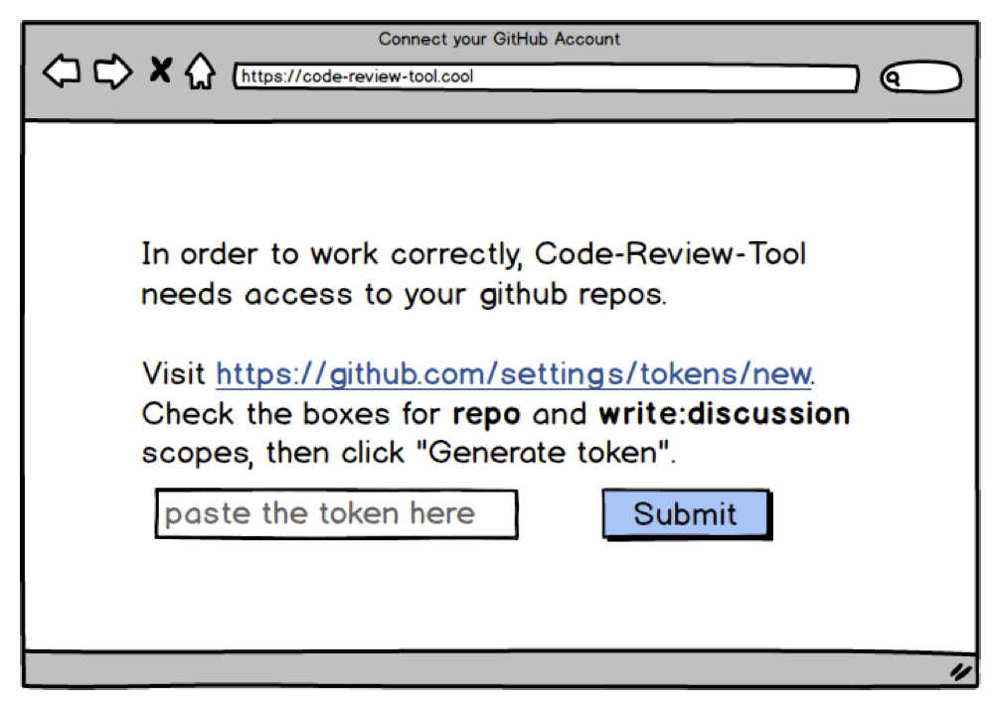
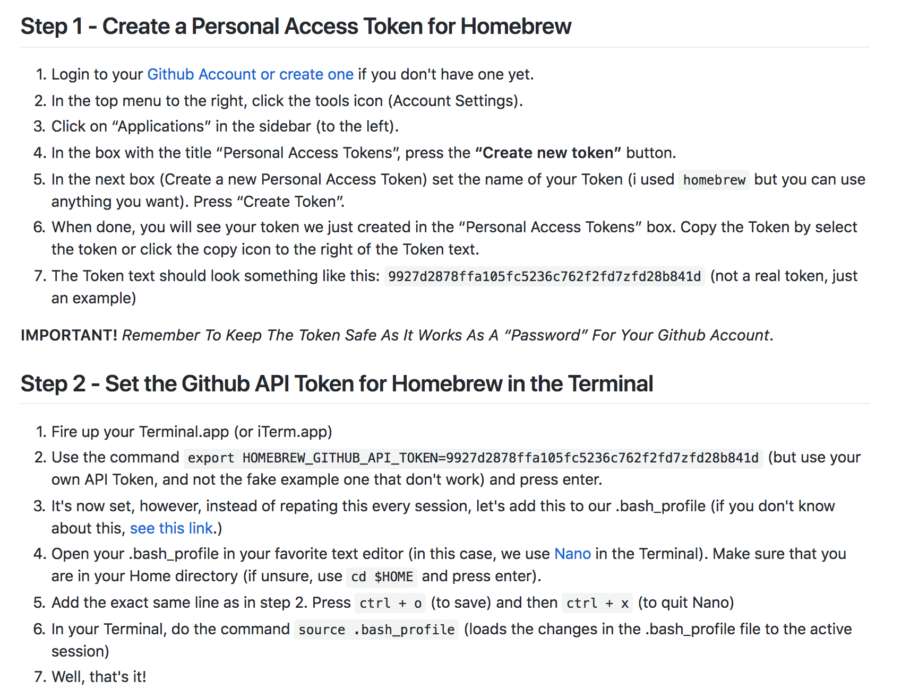
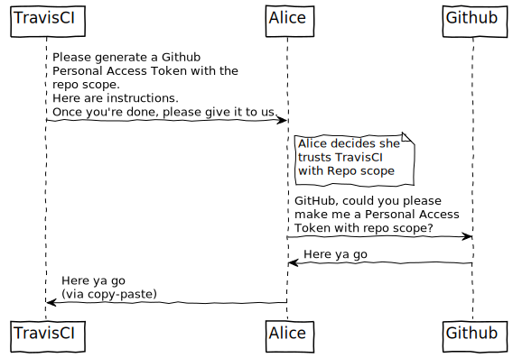
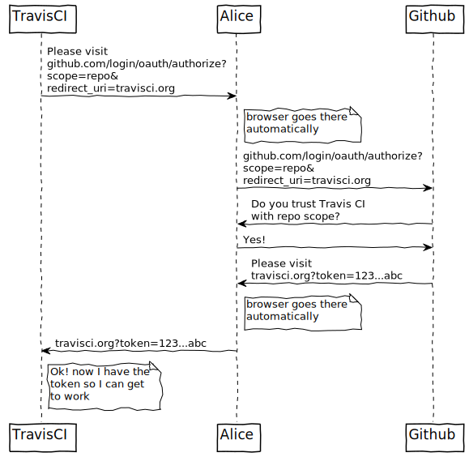
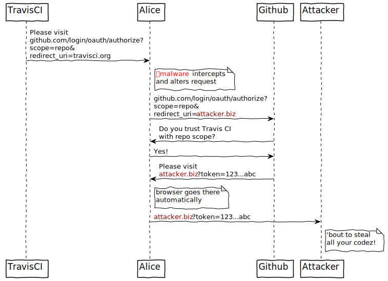
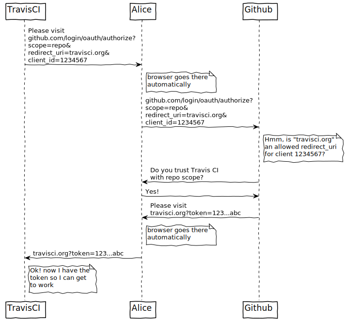
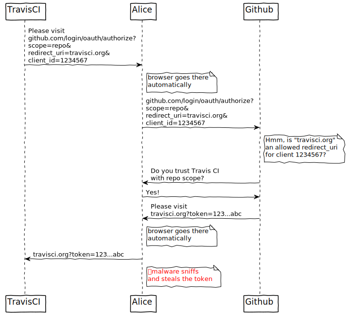
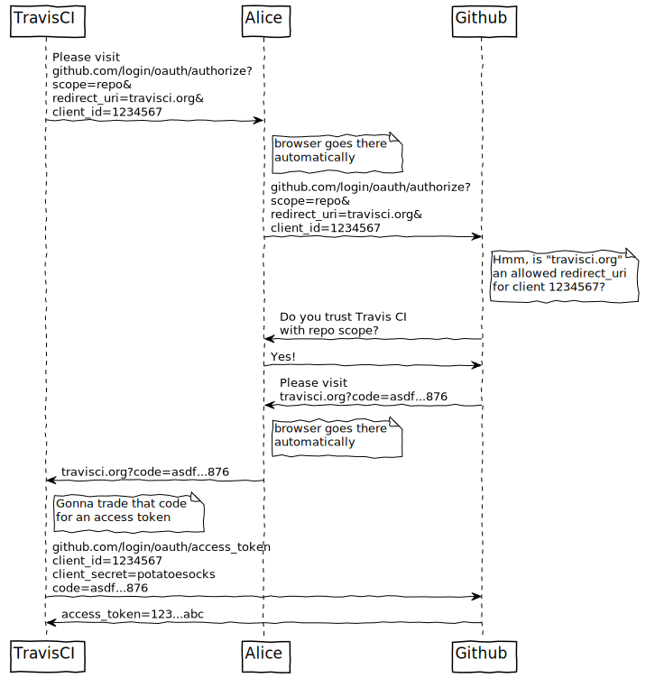
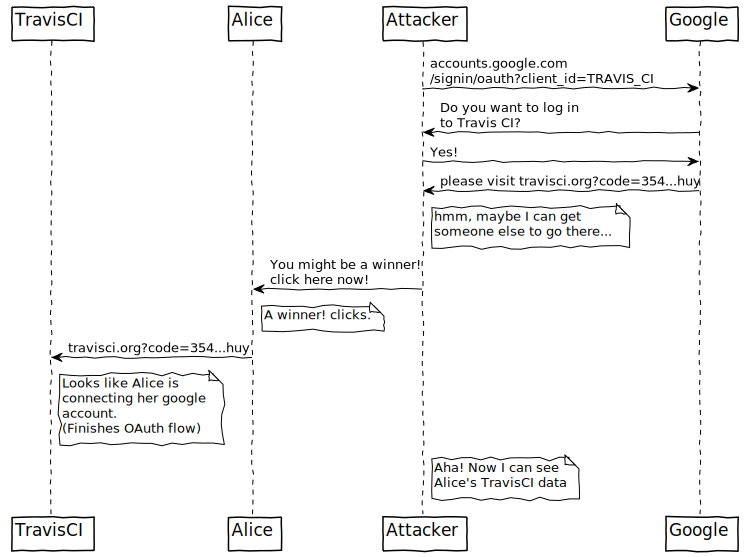
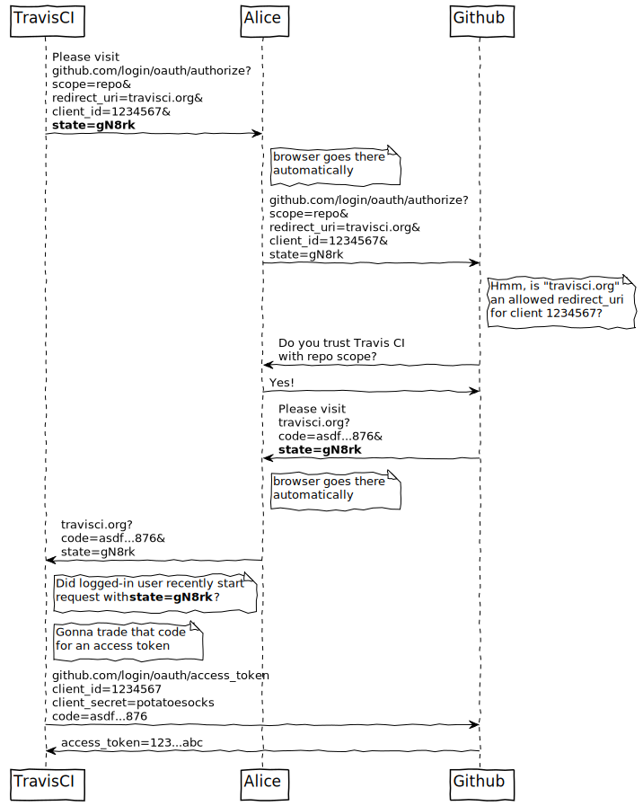

# Let's Build OAuth

OAuth is a topic that, at best, software developers _sorta_ understand. Tabbing between the provider documentation, code samples, and your editor, hoping that if you just expend enough frustrated mental energy, things will start to fit together; there must be a better way!

After attending this talk, you'll have a more intuitive understanding of OAuth. Instead of a jumble of disconnected pieces, you'll understand why we have both a client id and a client secret, what the "state" parameter is for, and why we're forced to exchange a grant token for an access token before doing anything useful.

We'll build oauth "from scratch", starting with "just share your password with me", and moving towards OAuth incrementally. Each step of the way will be motivated by a potential attack vector. Rather than memorizing rules, we'll see how each new addition to the structure mitigates a particular security vulnerability.


# Let's Build OAuth

"That which I cannot create, I do not understand"
-Richard Feynman
---
# Authentication vs Authorization
import { Appear } from 'mdx-deck'

<Appear>
  <p><strong>Authentication:</strong> This is who I am</p>
  <p><strong>Authorization:</strong> I am allowed to perform this action/see this data/etc</p>
  <p>nb: Authorization HTTP header is really about authentication.</p>
</Appear>

---
# OAuth is For...
---
OAuth is for...
## Authentication

eg, Login w/ Twitter says "I am the owner of the @bgschiller handle, and you can trust that b/c twitter says so"
---
OAuth is for...
## Delegated Authorization

"I give permission for HootSuite to post tweets on my behalf". You're giving some other entity (usually a program) the authority to act as if they were you.
---
So, let's build OAuth from scratch.
---
# Share your password pls


Drawbacks:
 - All or nothing. The app might really only need to read your tweets, but this permits posting, following, etc.
 - Tempting attack surface. A hacker gaining access to our db would get _actual passwords_, not just hashes.
 - Passwords can change. When this happens, access to every third-party service is cut off.
 - Encourages phishing attacks. We'd like to train users that they should only enter their google password on google sites, twitter password on twitter sites, etc.

 Benefits:
 - Requires no coordination with provider service.
 - Simple UI and mental model.

Who uses it?
 - Mint
 - [Yelp circa 2008](https://blog.codinghorror.com/please-give-us-your-email-password/)

# Personal Access Tokens




https://github.com/bgschiller/alfred-clipbox#logging-in-to-trello

Benefits:
 - Can be individually revoked
 - able to limit scope

Drawbacks:
 - Something of a UI headache
 - Requires coordination with provider service

Who uses it?
 - GitHub, Trello, Twitter, many others
 - Mostly targeted at developers

These are actually a solid step towards OAuth!

UX flow for personal access tokens is something like this.



What would it look like if we could get these sites to talk amongst themselves rather than making the user mediate it?

- The requesting service needs to inform the provider service which scopes it needs access to.
- The providing service needs to prompt the user: "Do you trust the requester? Are you cool with giving over this level of access?"
- If the user does trust the requester, the providing service needs to give a token back to the requesting service.

Usually we implement the first and last of those steps using HTTP redirects with query parameters. Here's how our UX flow changes.



And _that_ is the skeleton of OAuth! From here on out, every change will be about mitigating a potential attack or security vulnerability in the flow we hve now.

# Vulnerability Mitigations

### Attack: hijack the redirect_uri

Malware running on the user's computer or browser rewrites the request to point at their own domain. That sends the token to their own domain.



### Mitigation: pre-register with the provider

We can specify ahead of time a few URLs that might show up as redirect URLs. We give these to the provider and say "Please only redirect to one of these domains".



This can be a pain in the butt for development, especially if the provider requires https, even for localhost domains. Protip: in cases like that, you can often use `ngrok` to save yourself some headache.

### Attack: steal token from URL

Malware running on the user's computer or browser can watch the url bar and use the token revealed there. At that point, the malware has the same permissions just granted to the service.



### Mitigation: make those tokens worthless

The usual fix for this problem is to lower the importance of the value returned in the URL. Instead of giving back the access token directly, let's use a little indirection.

The OAuth provider will give back an authorization code, which is useful for only one thing: retrieving an access token. But! we'll force the requesting service to pass along a bit of extra information to prove they're not some malware-in-the-middle. This extra piece of information is usually called the client secret.



### Attack: Connect to attacker's account

We've been assuming that attackers are trying to gain access to data in the Provider service (Github in this case). We're going to change tack with this next example, and consider sensitive data in the Requester service (TravisCI).

Suppose an attacker is able to connect *their* google account with *your* TravisCI. They'd be able to "Login with Google" and see all your builds, including secrets and environment variables. How would this work?

One way would be if they run OAuth "Login with Google" *most* of the way, then try to trick you into doing the very last step: telling TravisCI "here's your authorization code". If they can get you to do the last step, *their* google account is associated with *your* TravisCI account.



### Mitigation: Ensure the logged-in user is originator of request

Upon receiving a an authorization code, check if the logged-in user was truly the person who sent off the request.



Bonus: you can record other information here too. For example, maybe you support logging in with Google, FB, and Twitter. When you get an authorization code, how do you know which provider gave it to you? Embed the name of the provider when you first start the flow.

### How I often build state

```
payload = JSON.stringify({
  issued_at: Date.now(),
  user_id: session.user_id,
  login_with: 'twitter',
});

signature = hmac(SECRET_KEY, payload);

state = (
  urlSafeBase64(payload) + '.' +
  urlSafeBase64(signature)
);
```